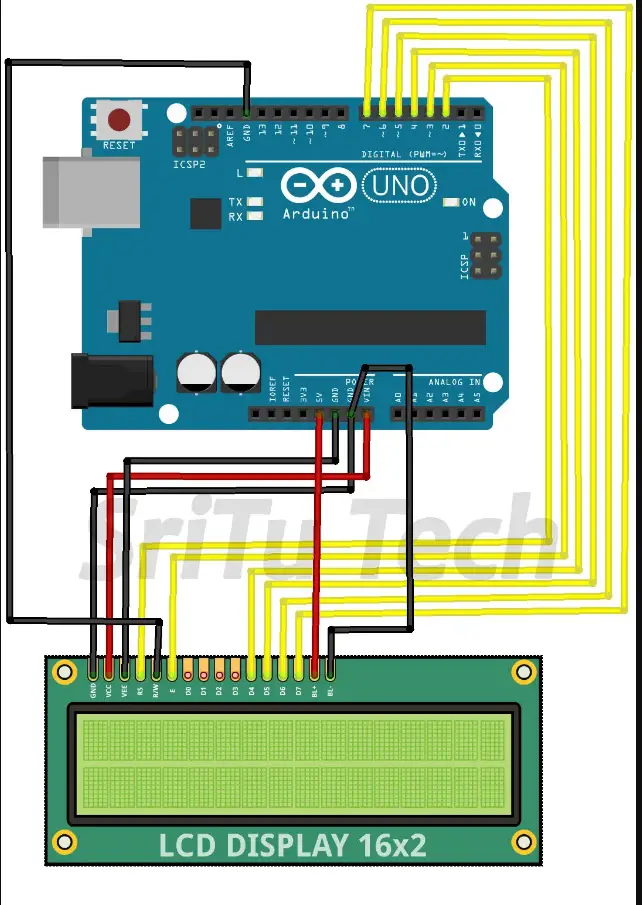

# CPU + RAM LCD Display

Live PC stats on a 16×2 LCD: CPU, RAM, WiFi name, and ping all via Arduino.



## What you need

- Arduino Uno
- 16×2 LCD (4-bit mode)
- USB cable

## Setup

1. **Wire** the LCD to the Arduino (see diagram above).
2. **Upload** `arduinocode/arduinocode.ino` with the Arduino IDE.
3. **Install Python deps:**
   ```bash
   pip install psutil pyserial
   ```
4. **Set your COM port** in `monitor.py` (line 7).
5. **Run** `Start Monitor.bat` or `python monitor.py`.

## Display

| Line 1 | `CPU:45% RAM:62%` |
| Line 2 | `WIFI Ping:24ms` |

Updates every second. Shows “Waiting for connection…” until the PC script is running.
